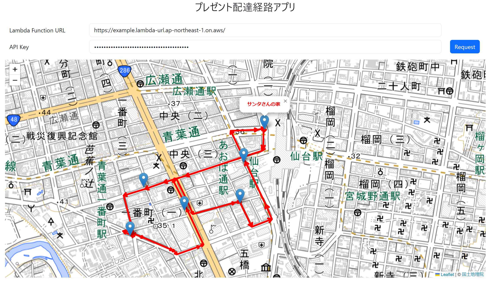
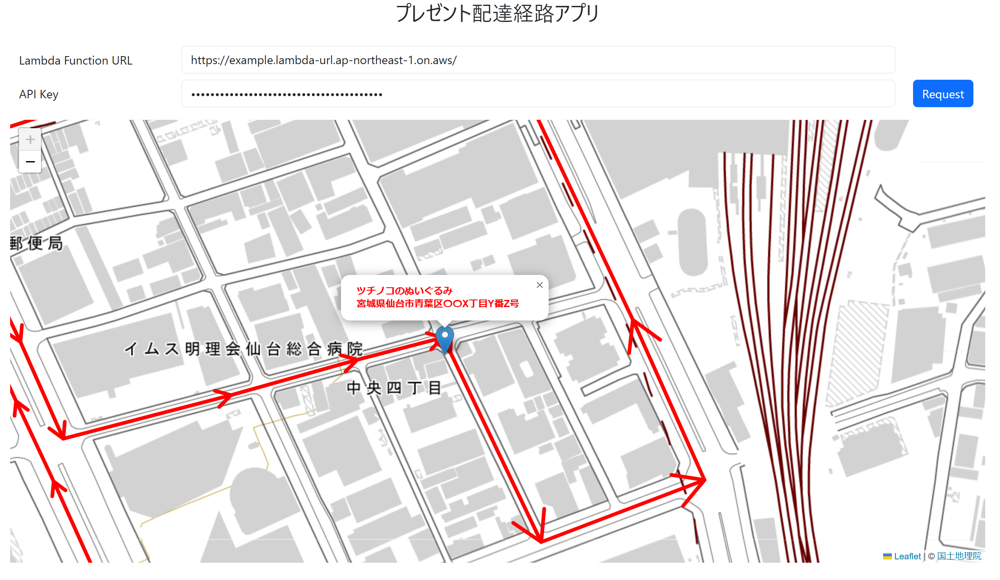
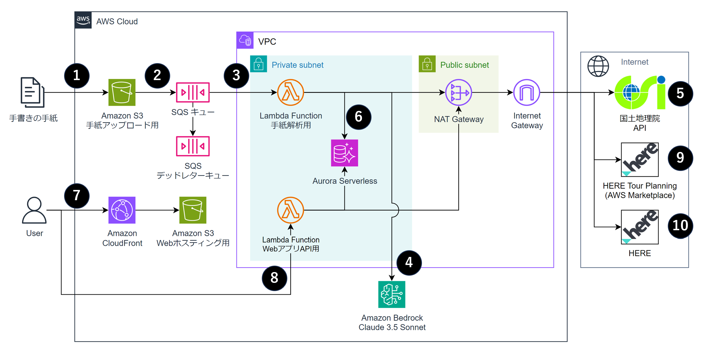

# サンタさんのプレゼント配達システム

**手紙画像から情報抽出を行い、最適な配達経路を地図上に表示するシステムをAWS上に構築します**

ブログ記事「[tmp](.)」のために作成したものになります。  
次のような特徴があります。

- 生成AI(Amazon Bedrock)を使い、こどもの手書きの手紙から情報を抽出
- AWS Marketplaceで提供されるSaaSを使い、複数の住所への最適な配達経路を取得
- WebアプリとAPIを簡単にリリース（API GatewayやALBを使わない）


## イメージ

入力画像


Webアプリ画面






## アーキテクチャ図



## デプロイ方法

### 前提条件

- AWS CDKにて`cdk bootstrap`が完了している必要があります
- `@aws-cdk/aws-lambda-python-alpha`にてLambdaレイヤーを作成するためDockerが起動している必要があります
- パラメーターストアに以下パラメーターが必要です
  - `/santa-present/api-key`: アプリのAPIキー（好きな値を設定）
  - `/santa-present/here-developer-api-key`: hereのtourplanning APIを叩けるAPIキー
  - `/santa-present/here-platform-api-key`: hereのrouter APIを叩けるAPIキー

### デプロイ

- 設定は`lib/app-config.ts`で行います

```sh
$ npm ci
$ cdk deploy
```

- RDSクエリエディタから `resources/sql/setup_postgis.sql` のクエリを実行しAuroraで地理情報を扱えるようにします
- RDSクエリエディタから `resources/sql/create_tables.sql` のクエリを実行し必要なテーブルとデータを作成します

## License

[MIT](./LICENSE-MIT)


